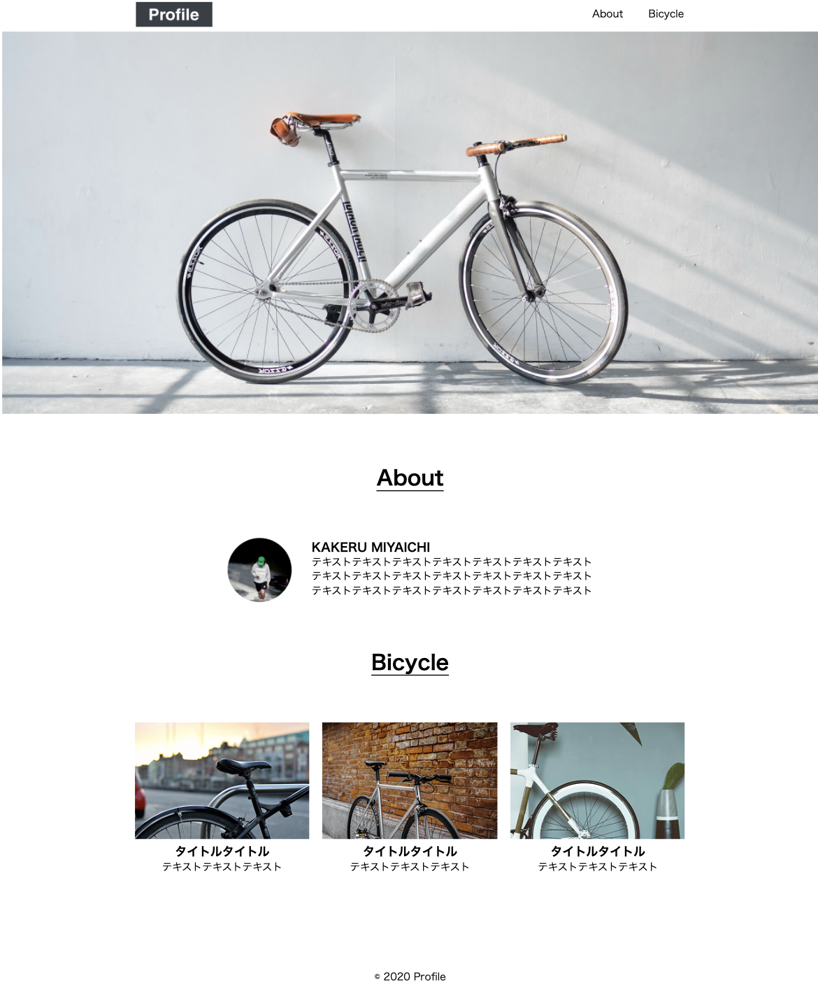

### 作成したサイト
Profile

### 使用したHTMLタグ
`<!DOCTYPE html>``<<html long="ja">``<meta cheset=UTF-8>`  
`<meta>``<link>``<head>``<body>``<header>``<main>`
`<a>``
``<ime>``<h2>``<h3>``
``<section>``<footer>`  

### 画像のパスで気をつけたこと
スペースは見分けがつかないので使用しない

### つまずいたポイントと解決方法
cssのコマンド　　
ひたすらに調べる

### デザインカンプ通りにできたか
marginなどをどう測っていいかわからなかったためずれている

### スクリーンショット
