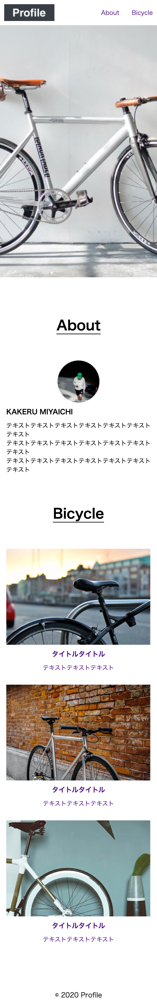

### 作成したサイト
Profile

### 使用したHTMLタグ
`<!DOCTYPE html>``<<html long="ja">``<meta cheset=UTF-8>`  
`<meta>``<link>``<head>``<body>``<header>``<main>`  
`<a>``
``<ime>``<h2>``<h3>``
``<section>``<footer>`  
`<ul>``<li>`
### 画像のパスで気をつけたこと
スペースは見分けがつかないので使用しない  
大文字を使用しない  

### つまずいたポイントと解決方法
モバイル版のレイアウトがどうしても崩れてしまう  
cssに追加  
img {  
    max-width: 100%;  
    height: auto;  
}

### デザインカンプ通りにできたか
思い通りにはできた  

### スクリーンショット

